<!-- Header banner (stored in this repo, no external service) -->

  

  

---

### 👨‍🍳 About me

- 🎮 I build **Roblox games** in **Luau**, focused on clean systems, smooth UI and players who can't cheat their way through.
- 🍳 Currently working on **Cook!**, a restaurant tycoon where you take orders, cook real recipes and run your own eatery.
- ⚙️ Also writing **C++**, sharpening my fundamentals: memory, data structures and performance.
- 🦴 On the art side: **Blender rigging & animation**, and **UI sketching** before a single frame hits Studio.
- 🌱 Always learning: game architecture, networking and UX for players of every age.

### 🛠️ Languages & tools

  
  
  
  
  

### 🎨 Art & design

  
  
  
  

### 🚀 Featured project: Cook!

> A Roblox cooking tycoon. Claim a plot, accept customers, cook Filipino dishes like **Chicken Adobo**, serve, wash up and grow your restaurant.

| System | What it does |
|---|---|
| 🍲 **Cooking loop** | Fridge → storage → chopping → pot (strict recipe order) → stove → serving → dish washing |
| 🧑‍🤝‍🧑 **Customers** | Rarity-tiered NPCs with pathfinding, patience timers and seat management |
| 🛡️ **Fair play** | Server-authoritative gameplay with built-in game protection |
| 🧭 **Onboarding** | Spotlight tutorial, a chef NPC with expressions and voice, and a pathfinding guide beam |
| 🌳 **Progression** | Skill tree, customer rarities and saved player progress |

👉 Client-side showcase: <a href="https://github.com/Xyvanned/Cooking-Game-Public"><b>Cooking-Game-Public</b></a> (server logic stays private).

### 🩸 Open source: Roblox Loading Screen

> A cinematic, story-driven first-join loading screen for a horror survival game: 30 illustrated beats, typed narration and a blood-red vignette, running from `ReplicatedFirst`.

| Highlight | What it does |
|---|---|
| 🎬 **Story intro** | Image fade-in/out with slow push-in zoom and typewriter narration |
| ⏭️ **Skip hint** | Pulsing "Click anywhere to skip" after 10s (mouse, touch, gamepad) |
| 💾 **Shows once** | Saved with [ProfileStore](https://github.com/MadStudioRoblox/ProfileStore) by loleris; the owner always sees it |
| ⚡ **Lightweight** | Whole UI built in code, one reusable `ImageLabel`, background preloading |

  
  

### 📊 GitHub stats

  

### 📫 Connect

<!-- Add your links here, e.g.:

-->
Open to collaborating on Roblox projects. Feel free to reach out through GitHub.

  

